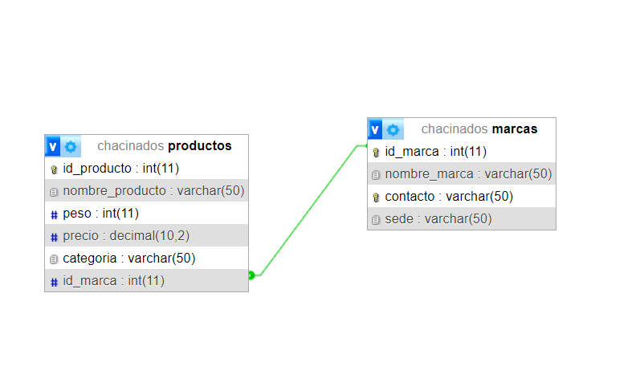

# Trabajo Práctico Especial. Web 2

## Integrantes:

* Coria, Agustín Ariel.
* Álvarez, Lautaro.

## Descripción

En este proyecto se desarrolla un sistema para administrar el stock de chacinados, almacenando información sobre su marca, su peso y su precio; y sus respectivas categorías (marcas), almacenando información sobre su contacto y sede.

- Al abrir el sitio, aparecerá una lista de todos los productos con su respectiva marca y su precio.
- Mediante la barra de navegación podrá acceder rápidamente a la lista de productos, lista de marcas y podrá iniciar o cerrar sesión.
- Al clickear en un elemento de la lista de marcas, podrá ver todos los productos de la misma.
- Al clickear en un elemento de la lista de productos, podrá ver más detalles sobre el mismo, incluyendo un hipervínculo a una lista de productos de la misma marca.
- Al iniciar sesión, el usuario podrá crear, editar y/o eliminar productos y marcas.
- El formulario para agregar un producto o marca aparecerá en la parte superior.
- Los botones para editar y eliminar aparecerán a la derecha de cada producto o marca.

## Usuario

* Nombre de usuario: webadmin.
* Contraseña: admin.

## Instrucciones para deploy

- Asegurarse de tener instalado xampp y estar corriendo Apache y MySQL.
- Clonar el repositorio en "C:/xampp/htdocs/".
- La base de datos se desplegará automáticamente (en caso contrario, dirigirse a http://localhost/phpmyadmin/ e importar la base de datos chacinados.sql).

## DIAGRAMA

