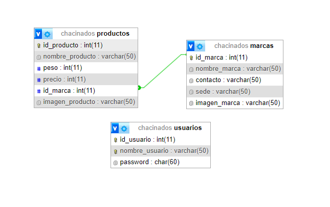

# Trabajo Práctica Especial. Web 2

## Integrantes:

* Coria, Agustín Ariel.
* Álvarez, Lautaro.

## Descripción

En este proyecto se desarrolla un sistema para administrar el stock de chacinados, almacenando información sobre su marca, su tipo, el peso y precio de cada producto, etc.

## DIAGRAMA
